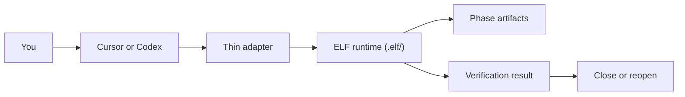

# ELF

ELF is an orchestrator runtime for structured development flows.

The short version:

- the real workflow state lives in `.elf/`
- Cursor and Codex are thin hosts on top
- the first fully chained flow shipped today is `phase`
- `verify` is part of the workflow, not an afterthought

If you were expecting "GSD or Superpowers, but with a local runtime", that is
the direction. This repository now ships the first real vertical slice of that
idea instead of only installer and adapter plumbing.

> Compatibility note: `spec-driven-kit` still exists as a legacy alias, but new
> usage should be `elf-orchestrator` with the `elf` CLI.

## What ELF Actually Does

ELF is not supposed to be a pile of prompts, templates, and installers.

ELF is supposed to:

1. open a durable workflow in the repo
2. move that workflow through explicit steps
3. persist the artifacts and state on disk
4. verify before the loop is allowed to close

That state lives in `.elf/`, not in Cursor rules, Codex prompts, or MCP client
memory.

## The Real Flow Shipped Today

Today the most complete host-native flow is `phase`.

Its chain is:

```text
start -> research -> plan -> execute -> verify -> close
```

When you start a phase, ELF creates a working directory under:

```text
.elf/phases/<phase-id>/
```

with durable artifacts:

- `spec.md`
- `research.md`
- `plan.md`
- `tasks.md`
- `verification.md`
- `decision-log.md`
- `state.json`

That `state.json` tracks the current step, completed steps, run id, phase id,
and overall status.

## Mental Model



The host should drive the runtime. The host should not become the runtime.

## 5-Minute Quick Start

### 1. Install the CLI

If the package is published:

```bash
npm install -g elf-orchestrator
```

If you are running from this checkout:

```bash
cd /path/to/elf-orchestrator
npm install
npm run build
npm install -g .
```

### 2. Install the host integrations you want

```bash
elf global install cursor
elf global install codex
```

You can also install both:

```bash
elf global install all
```

### 3. Enter a project and bootstrap the runtime

```bash
cd /path/to/project
elf init
```

This creates:

- `.elf/`
- `AGENTS.md`

### 4. Start a real phase

```bash
elf phase start --title "User auth"
```

ELF prints:

- `run-id`
- `phase-id`
- current step
- next step

### 5. Drive the chain

```bash
elf phase research <run-id>
elf phase plan <run-id>
elf phase execute <run-id>
elf phase verify <run-id>
elf phase close <run-id>
```

At any point:

```bash
elf phase status <run-id>
```

## A Concrete Tutorial

### Start

```bash
mkdir demo-elf
cd demo-elf
npm init -y
elf init
elf phase start --title "User auth"
```

Suppose ELF returns:

```text
Run ID: phase-user-auth-1234abcd
Phase ID: user-auth
Current step: research
Next step: research
Status: active
```

### Research

Use the research step to fill:

- `.elf/phases/user-auth/spec.md`
- `.elf/phases/user-auth/research.md`

Then advance:

```bash
elf phase research phase-user-auth-1234abcd
```

### Plan

Now fill:

- `.elf/phases/user-auth/plan.md`
- `.elf/phases/user-auth/tasks.md`

Then advance:

```bash
elf phase plan phase-user-auth-1234abcd
```

### Execute

Do the code work in the repo, using the artifacts in `.elf/phases/user-auth/`
as the source of truth.

Then advance:

```bash
elf phase execute phase-user-auth-1234abcd
```

### Verify

Run the verification step:

```bash
elf phase verify phase-user-auth-1234abcd
```

This persists verifier output under:

```text
.elf/runs/<run-id>/verifier.json
```

### Close

If verification passes:

```bash
elf phase close phase-user-auth-1234abcd
```

The phase state reaches `done`, and the run reaches `completed`.

## Using ELF from Cursor or Codex

The host integrations are intentionally thin.

They should:

- help the host call the right ELF command or MCP tool
- keep the host aligned with the step chain
- avoid re-implementing workflow semantics inside rules or prompts

### Cursor

Install globally:

```bash
elf global install cursor
```

The Cursor adapter now points at the real phase chain:

- `elf phase start`
- `elf phase research`
- `elf phase plan`
- `elf phase execute`
- `elf phase verify`
- `elf phase close`

### Codex

Install globally:

```bash
elf global install codex
```

The Codex adapter now ships phase-step skills so Codex can drive the same real
runtime chain instead of only telling you to "use the CLI".

## MCP Bridge

If you want a host or local client to talk to the runtime over MCP:

```bash
elf mcp serve
```

The bridge now exposes both the generic runtime tools and the real phase-chain
tools:

- `elf_run`
- `elf_phase_start`
- `elf_phase_research`
- `elf_phase_plan`
- `elf_phase_execute`
- `elf_phase_verify`
- `elf_phase_close`
- `elf_phase_status`
- `elf_resume`
- `elf_review`
- `elf_verify`
- `elf_status`

That means the MCP surface can now drive the same `phase` workflow that the CLI
and adapters use.

## Global vs Project

Keep this distinction in your head and the product gets much simpler:

- `elf global install ...` prepares your machine host
- `elf init` prepares the current repository
- `elf doctor` validates the repo runtime
- `elf global doctor` validates the host install

In short:

- host integration is global
- workflow state is local

## Commands That Matter First

If you ignore everything else, learn these first:

```bash
elf init
elf phase start --title "My feature"
elf phase status <run-id>
elf phase research <run-id>
elf phase plan <run-id>
elf phase execute <run-id>
elf phase verify <run-id>
elf phase close <run-id>
```

Everything else is supporting infrastructure.

## Advanced Commands

Runtime support:

- `elf run`
- `elf resume`
- `elf review`
- `elf verify`
- `elf doctor`

Host integration:

- `elf global install cursor|codex|all`
- `elf global update cursor|codex|all`
- `elf global doctor cursor|codex|all`
- `elf global uninstall cursor|codex|all`

Project-local adapters:

- `elf adapter install cursor`
- `elf adapter install codex`
- `elf adapter update cursor`
- `elf adapter update codex`
- `elf adapter doctor cursor`
- `elf adapter doctor codex`

## Current Scope

What is real and tested now:

- project runtime in `.elf/`
- real `phase` chain
- Cursor and Codex adapters pointing at that chain
- MCP bridge that can drive the chain
- global host installers for Cursor and Codex

What is still foundation or lighter weight:

- the other workflow types outside the `phase` slice
- richer automatic orchestration on top of the step chain

That is intentional. The repo now ships one real flow instead of many fake ones.

## References

- [TECH notes](docs/TECH.md)
- [Minimal example](examples/minimal-project/README.md)
- [Host flow vertical-slice design](docs/plans/2026-04-01-elf-host-flow-vertical-slice-design.md)
