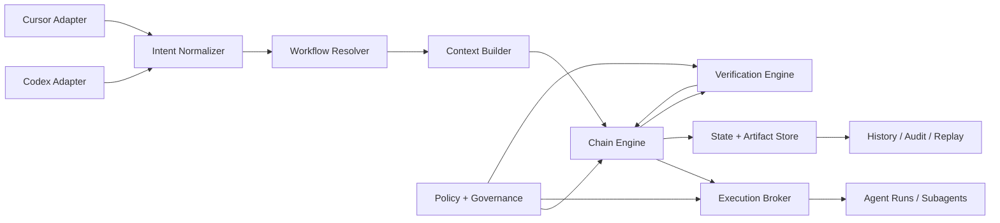
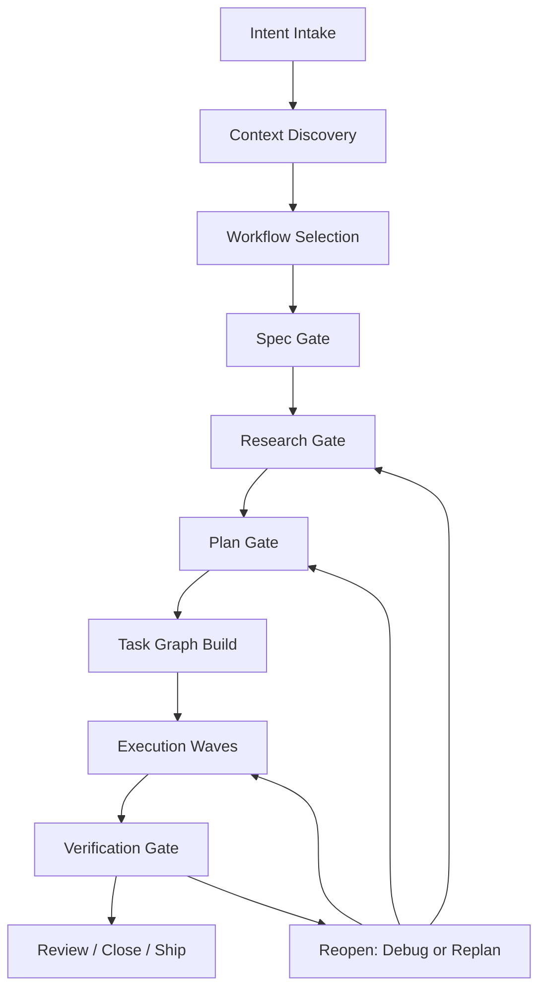

# ELF Orchestrator-First Design

**Status:** Approved by maintainer  
**Date:** 2026-04-01  
**Scope:** Redefine this repository from a Cursor-first spec-driven kit into an orchestrator-first system for workflow injection, context engineering, and spec-driven development, with thin adapters for Codex and Cursor in v1.

---

## 1. Vision

ELF becomes a lightweight orchestrator for coding-agent workflows.

The system owns:

- workflow chaining
- spec-driven artifact generation
- execution state
- verification gates
- replay and resumption
- governance and policy decisions

Codex and Cursor are not the workflow engine. They are host environments that invoke ELF and render its outputs through their native primitives.

This design combines:

- the artifact rigor and execution discipline of GSD
- the workflow chaining, task-centric orchestration, and history model of Traycer
- a portable file-based runtime that is not tied to one editor or one vendor surface

---

## 2. Product Direction

### 2.1 Strategic choice

ELF is **own orchestrator first**.

This means:

- the runtime is the source of truth
- the host editor is an adapter, not the control plane
- workflow definitions live in ELF
- policy, verification, and state are resolved in ELF

### 2.2 Why this direction

This direction gives ELF maximum control over:

- task lifecycle
- artifact requirements
- agent decomposition
- policy enforcement
- completion criteria
- resumability

It also prevents workflow behavior from being fragmented across Codex- and Cursor-specific features that may evolve independently.

### 2.3 Non-goals for v1

- building a full SaaS control plane
- depending on host-specific hidden behavior
- treating prompts alone as the product
- introducing a heavyweight enterprise workflow with excessive ceremony

---

## 3. Core Principles

### 3.1 Spec-driven by contract

Specs are not onboarding artifacts only. They are the contract checked at every major gate.

### 3.2 Chains over prompts

Workflows are explicit chains of state transitions, not large monolithic prompts.

### 3.3 Verification is independent

Execution does not get to self-certify completion. Verification is a distinct function.

### 3.4 File-based truth

Artifacts and run state must remain inspectable and portable on disk.

### 3.5 Thin adapters

Hosts may add guardrails and UX, but they do not redefine workflow semantics.

---

## 4. Runtime Architecture

### 4.1 System model



### 4.2 Components

#### Intent Normalizer

Transforms host events into canonical ELF intents such as:

- `new-task`
- `new-phase`
- `new-epic`
- `continue-run`
- `verify-run`
- `review-change`
- `debug-issue`
- `ship-phase`

#### Workflow Resolver

Chooses the appropriate chain based on:

- intent
- scope
- ambiguity
- technical risk
- available artifacts
- adapter capabilities

#### Context Builder

Builds task-specific context briefs from:

- `AGENTS.md`
- workflow definitions
- prior artifacts
- run history
- relevant repo files
- policy constraints
- host limits

#### Chain Engine

Advances workflow nodes according to declared transitions, gates, and retry rules.

#### Execution Broker

Selects the execution path for each node:

- main host agent
- host subagent
- specialized verifier
- parallel worker
- local CLI operation
- MCP-mediated tool call

#### State + Artifact Store

Persists durable project artifacts and operational run state.

#### Verification Engine

Checks claims against specs, task definitions, observed changes, and evidence.

#### Policy + Governance

Evaluates risk, tool permissions, evidence requirements, and human checkpoints.

---

## 5. Workflow Model

### 5.1 Canonical chain



### 5.2 Gates

#### Spec Gate

No implementation proceeds without a spec proportional to the work.

#### Research Gate

Activated only when uncertainty, external systems, or technical risk justify it.

#### Plan Gate

Produces an executable plan and an explicit task graph, not a loose checklist.

#### Verification Gate

Requires evidence before a workflow may close.

### 5.3 Reopen logic

Failures reopen the correct stage rather than restarting the whole workflow:

- understanding issues reopen spec or research
- decomposition issues reopen planning
- implementation issues reopen execution or debug
- mismatch against the contract reopens verification or planning

---

## 6. Workflow Types for v1

### 6.1 `task`

Compact workflow for small, bounded changes.

Chain:

- intake
- spec-lite
- plan-lite
- execute
- verify
- close

### 6.2 `phase`

Primary workflow for meaningful feature work.

Chain:

- intake
- context
- spec
- optional research
- plan
- task graph
- execution waves
- verify
- close

### 6.3 `epic`

Breaks large efforts into phases and dependencies without implementing all work directly.

### 6.4 `review`

Inspects a branch, diff, plan, or artifact set and returns structured findings.

### 6.5 `debug`

Specialized workflow for reproduction, isolation, fix validation, and closeout.

### 6.6 `ship`

Final packaging and release handoff workflow after verification passes.

---

## 7. Filesystem and Artifact Model

### 7.1 Root structure

```text
AGENTS.md
.elf/
  config.toml
  workflows/
  templates/
  adapters/
  project/
  epics/
  phases/
  runs/
  state/
  logs/
  cache/
```

### 7.2 Durable artifacts

Durable artifacts explain what the work is and why it exists.

Example:

```text
.elf/phases/042-user-auth/
  spec.md
  research.md
  plan.md
  tasks.md
  verification.md
  decision-log.md
  state.json
```

### 7.3 Operational artifacts

Operational artifacts explain how a specific execution unfolded.

Example:

```text
.elf/runs/run_2026_04_01_abc123/
  run.json
  events.jsonl
  context/
  outputs/
  transcript/
  verifier.json
```

### 7.4 State layers

ELF tracks three state layers:

- project state
- work state
- run state

This separation prevents planning documents from being overloaded with runtime telemetry.

---

## 8. Runtime Surfaces

### 8.1 CLI

ELF provides direct commands such as:

- `elf run`
- `elf resume`
- `elf verify`
- `elf review`
- `elf doctor`

### 8.2 Local MCP server

The primary integration bridge for hosts in v1.

Benefits:

- one orchestration core
- minimal host-specific duplication
- compatibility with Codex and Cursor
- extensibility toward future hosts

### 8.3 File convention

Even without a live runtime process, the project remains understandable and recoverable through files on disk.

---

## 9. Adapter Strategy

### 9.1 Codex adapter

The Codex adapter may include:

- plugin bundle
- skills
- subagents
- optional hooks
- optional rules
- runtime bridge through MCP or CLI

Its job is to:

- map Codex invocations to ELF intents
- provide host-aware context
- return output in a way that feels native inside Codex

It must not:

- become a second workflow engine
- maintain a competing state store
- define workflow transitions independently of ELF

### 9.2 Cursor adapter

The Cursor adapter may include:

- plugin bundle
- rules
- skills
- subagents
- optional hooks
- MCP or CLI bridge to ELF

Its job is to:

- expose ELF workflows through native Cursor surfaces
- add local guardrails
- forward authority to the ELF runtime

It must not duplicate orchestration semantics.

### 9.3 Why MCP is the main bridge

MCP is the cleanest shared integration surface between Codex and Cursor in v1 because it reduces logic duplication and keeps the runtime central.

---

## 10. Governance and Policy

### 10.1 Risk classes

Each run and node receives a risk class:

- `low`
- `medium`
- `high`

Risk controls:

- tool availability
- parallelism
- human checkpoints
- evidence requirements
- whether execution may proceed automatically

### 10.2 Canonical guardrails

The runtime enforces:

- no spec, no execution
- no plan, no wave execution
- no verification, no close
- no silent scope expansion
- no host-specific state as the source of truth

### 10.3 Human checkpoints

Recommended checkpoints in v1:

- after spec approval for medium/high-risk work
- before ship
- on major replan after failure

---

## 11. Failure Model

### 11.1 Failure classes

- spec failure
- planning failure
- execution failure
- verification failure
- policy failure
- runtime failure

### 11.2 Canonical actions

The runtime responds with explicit actions:

- `reopen_spec`
- `reopen_plan`
- `retry_node`
- `reroute_to_debug`
- `request_human_decision`
- `abort_run`
- `resume_run`

### 11.3 Resumability

Every run must be resumable from stored state so work can continue across host switches, interruptions, or context loss.

---

## 12. Verification Model

### 12.1 Independent verifier

Verification compares:

- the spec
- the plan or task node
- observed changes
- attached evidence

### 12.2 Evidence types

Evidence may include:

- tests
- diffs
- command outputs
- logs
- screenshots
- generated artifacts
- acceptance checklists

### 12.3 Verification outcomes

- `pass`
- `pass-with-notes`
- `fail-reopen-node`
- `fail-replan`

Work cannot close solely because an agent claims completion.

---

## 13. v1 Scope

### 13.1 Included

- local file-based runtime
- CLI
- local MCP server
- workflows: `task`, `phase`, `debug`, `review`
- simplified `epic`
- artifact store under `.elf/`
- resumable run state
- verification gate
- thin Codex adapter
- thin Cursor adapter
- `AGENTS.md` as the project contract

### 13.2 Deferred

- hosted UI
- cloud sync
- heavy analytics
- organization-scale policy management
- remote distributed execution
- deep support for many additional hosts in v1

### 13.3 Success criteria

ELF v1 succeeds if:

1. a project can complete a full phase without relying on host memory
2. Codex and Cursor operate as clients of the same runtime
3. interrupted work can resume from saved state
4. the verifier blocks false completion claims
5. the system feels lightweight enough to use daily

---

## 14. Source Alignment

This design is informed by:

- Codex official documentation for subagents, skills, plugins, hooks, rules, and MCP
- Cursor official documentation for rules, skills, subagents, hooks, plugins, and MCP
- GSD for artifact rigor, staged execution, and verification discipline
- Traycer for workflow chaining, task-centric orchestration, and AGENTS-aware flow design

The intention is not to clone any one system literally. ELF should synthesize the strongest ideas into a runtime that remains legible, portable, and lighter-weight than a hosted orchestration platform.
